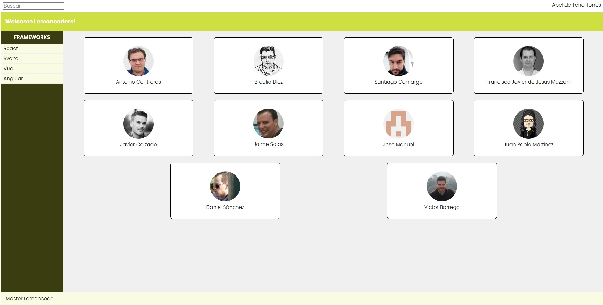
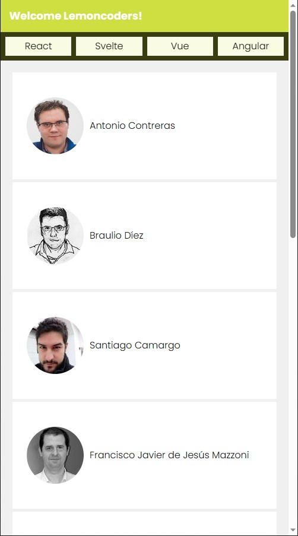

# Master Frontend Módulo 1 Layout :lemon:

## Ejercicio Extra :trophy:

### Crear un Layout para una aplicación, que contendrá:

- Header: - Toolbar con un input de texto para búsquedas y nombre del usuario logado. - Barra con el nombre de la aplicación.
- Nav: - Menú con varias opciones de navegación.
- Main: - Contenido con la información principal de la aplicación. - Fondo diferente de blanco.
- Footer: - Texto de la compañía, al final de la página (aunque el contenido no ocupe todo el alto)

### Consideraciones

- No perder en ninguna resolución la barra de navegación al hacer scroll. :desktop_computer:

- En resoluciones pequeñas (hasta 768px de ancho): :iphone:
  - Contenido a ocultar:
    - Barra superior con input de búsqueda y nombre de usuario
    - Título del menú
  - Cambiar menú a la parte superior, bajo el header.
  - Cambiar la organización del contenido principal para visualizarlo sin problema

